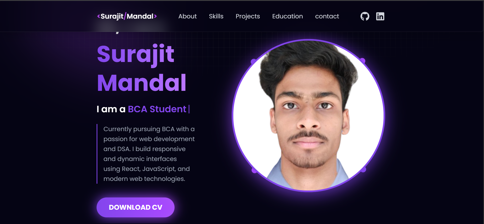

# 🚀 Personal Portfolio Website (React)

Hi! I'm **Surajit**, a frontend web developer and BCA student. This is my personal portfolio built using **React** and modern web technologies. It showcases my projects, skills, and a bit about me!

🔗 **Live Site**: [https://myportfolio-azure-chi.vercel.app/]

---

## ✨ Features

- ⚛️ Built with React (SPA)
- 🎨 Responsive & modern UI
- 💼 Projects section with live demo links
- 📧 Contact form (EmailJS)
- 🌐 Smooth scrolling 

---

## 🧰 Tech Stack

- **Frontend**: React, JSX, CSS Modules / Tailwind / Styled Components
### 📦 Notable Packages Used

| Package                          | Purpose                                     |
|----------------------------------|---------------------------------------------|
| `react-parallax-tilt`            | Adds tilt animation to cards or components |
| `react-vertical-timeline-component` | Beautiful vertical timeline layout       |
| `react-toastify`                 | Toast notifications (e.g. on form submit)  |
| `react-typewriter-effect`        | Typewriter animation for text              |
| `react-icons`                    | Icon library                               |
| `emailjs-com`                    | Send email via form                        |


---
## 📷 Screenshots


```markdown


