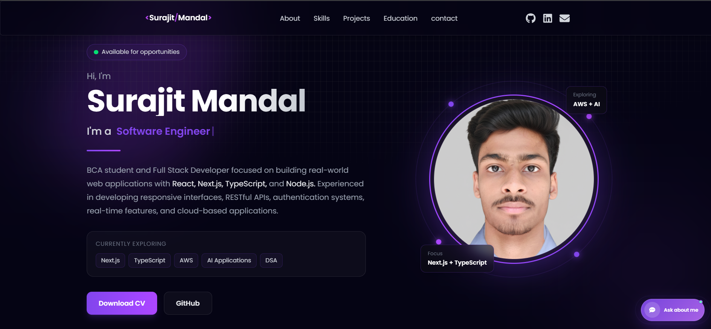
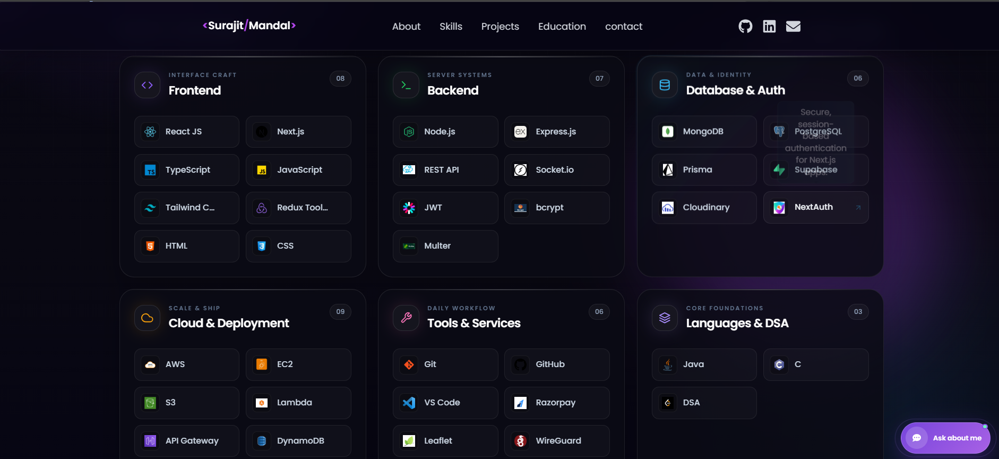
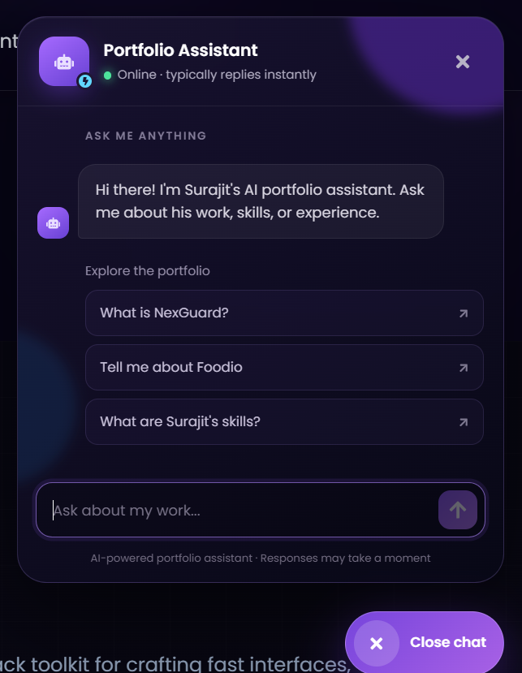

# 🚀 Surajit Mandal — Personal Developer Portfolio

A modern, responsive developer portfolio built with **React.js** to showcase my projects, technical skills, development journey, and experience as a BCA student and Full Stack Developer.

The portfolio also includes an **AI-powered portfolio assistant** that allows visitors to interact with my portfolio and ask questions about my projects, skills, education, and development experience.

🔗 **Live Portfolio:**  
https://surajitportfolio.vercel.app/

---

## ✨ Features

### 🎨 Modern Portfolio UI

- Responsive design for desktop, tablet, and mobile
- Modern dark-themed developer interface
- Smooth scrolling navigation
- Animated hero section
- Interactive project cards
- Skills section with technology icons
- Experience / education timeline
- Contact section
- Social media integration
- Responsive navigation

### 🤖 AI Portfolio Assistant

The portfolio includes an AI-powered chatbot designed specifically around my portfolio.

Visitors can ask questions such as:

- What is NexGuard?
- Tell me about Foodio
- What technologies were used in NexGuard?
- What are Surajit's skills?
- What is Surajit's education?
- What projects has Surajit built?

The chatbot uses a **Retrieval-Augmented Generation (RAG)** architecture so that responses are generated using information stored in my portfolio knowledge base.

### 🧠 RAG Architecture

The chatbot follows this flow:

```text
User Question
      ↓
React Chatbot
      ↓
Express.js Backend
      ↓
Gemini Embedding
      ↓
Supabase + pgvector
      ↓
Relevant Portfolio Information
      ↓
Gemini LLM
      ↓
AI Response
      ↓
React Chatbot
```
## 🧰 Tech Stack

### Frontend

- React.js
- JavaScript
- JSX
- Tailwind CSS
- CSS
- React Hooks
- Axios

### Backend

- Node.js
- Express.js
- REST API
- CORS
- dotenv

### AI / RAG

- Google Gemini API
- Gemini Embeddings
- Retrieval-Augmented Generation (RAG)
- Semantic Search
- Vector Embeddings

### Database & Vector Search

- Supabase
- PostgreSQL
- pgvector
- SQL RPC Functions

---

## 📸 Screenshots

### 🏠 Home



### 🛠️ Skills



### 🤖 AI Portfolio Assistant



---
## ⭐ Support

If you find this project useful or interesting, consider giving the repository a ⭐.

---

**Built with ❤️ by Surajit Mandal**